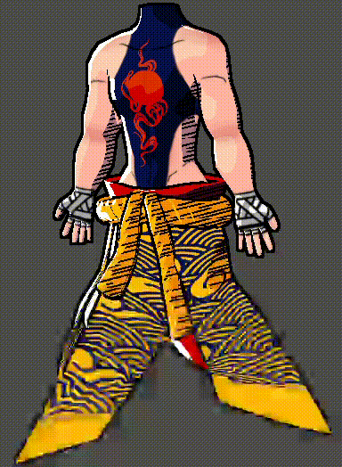

# Shaders Godot — Rendu Cartoon / Manga

Deux shaders GLSL développés dans Godot pour explorer les techniques
de rendu stylisé temps réel : post-processing et cel-shading avancé.

---

## 1. Post-Process Shader — Outline automatique

**Technique :** détection de silhouettes par lecture de la depth map.

- Outline noir appliqué automatiquement à tous les modèles de la scène
- Effet post-process full-screen, indépendant des meshes

## 2. Texture Shader — Cel-shading style manga

**Technique :** éclairage discrétisé, normal maps custom, effets animés.

- Cel-shading à 3 tons par couche, palette définie sur une texture 3×6 pixels
- Normal maps personnalisées pour enrichir les détails sans modifier la géométrie
- Rim light pour accentuer les contours
- Outline animé (tremblement des bords de silhouette)
- Hatching animé sur les zones d'ombre
- Superposition de couches via textures-masks peintes à la main

---

## Compétences démontrées

- Programmation shaders GLSL dans Godot (Spatial Shader / CanvasItem)
- Techniques de post-processing (depth buffer, full-screen quad)
- Cel-shading et stylisation visuelle temps réel
- Gestion de normal maps, masques et textures animées

---

## Usage

1. Assigner `textureShader` aux modèles (fournir les textures appropriées
   et une texture blanche pour les couches vides)
2. Créer un quad attaché à la caméra et lui assigner `postProcess`
3. Les deux shaders sont indépendants et peuvent être utilisés séparément

